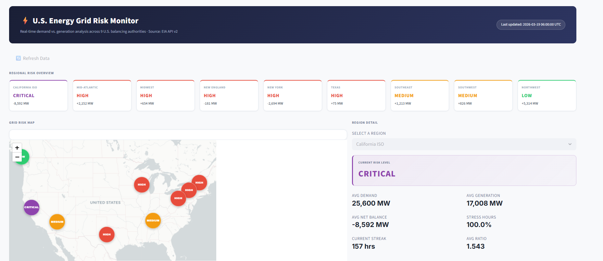
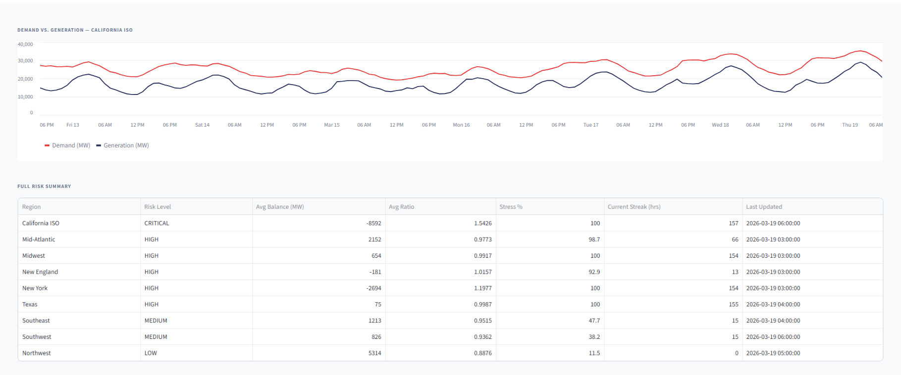
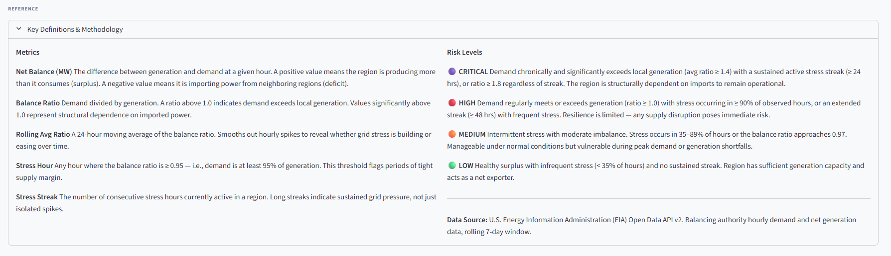

# ⚡ U.S. Energy Grid Risk Monitor

A real-time operational intelligence tool that ingests live U.S. electricity data, runs an automated risk scoring pipeline, and surfaces grid stress signals to operators through an interactive dashboard.

Built to mirror the data workflows Palantir Foundry deploys with utility and infrastructure clients — raw data in, clean ontology out, actionable decision support on top.

---

## The Problem

Grid operators across the U.S. manage a constant balancing act: generation must meet demand in real time. When demand chronically outpaces local generation, regions become dependent on imported power — and vulnerable to cascading failures if interconnections are disrupted. Identifying *which* regions are structurally stressed, and *how* stressed they are right now, is an operational problem with real consequences.

This tool answers that question continuously, across all 9 major U.S. balancing authorities.

---

## Dashboard







---

## Architecture

A five-layer pipeline, each stage independently testable:

```
[Ingest]  →  [Transform]  →  [Score]  →  [Storage]  →  [Dashboard]
EIA API       Clean + derive   Risk level   DuckDB        Streamlit
              operational      assignment   persistence   + Folium
              fields
```

| Layer | File | Description |
|---|---|---|
| Ingestion | `src/ingest.py` | Pulls hourly demand & generation from EIA API v2 for 9 regions |
| Transform | `src/transform.py` | Derives net balance, balance ratio, rolling averages, stress flags |
| Scoring | `src/score.py` | Assigns CRITICAL / HIGH / MEDIUM / LOW risk per region |
| Storage | `src/storage.py` | Persists time series and scores to DuckDB |
| Dashboard | `app.py` | Interactive Streamlit app with geospatial map and time series |

---

## Key Findings (as of March 2026)

| Region | Risk | Avg Net Balance | Stress Hours |
|---|---|---|---|
| California ISO | CRITICAL | -8,601 MW | 100% |
| New York | HIGH | -2,692 MW | 100% |
| Texas | HIGH | +78 MW | 100% |
| Midwest | HIGH | +672 MW | 100% |
| Mid-Atlantic | HIGH | +2,149 MW | 98.7% |
| New England | HIGH | -183 MW | 92.9% |
| Southeast | MEDIUM | +1,212 MW | 47.7% |
| Southwest | MEDIUM | +831 MW | 38.2% |
| Northwest | LOW | +5,297 MW | 11.5% |

**California** never generates enough to meet its own demand — running a chronic -8,601 MW deficit driven by solar intermittency and high consumption. **Texas (ERCOT)** operates with a razor-thin +78 MW average surplus on a ~49,000 MW system. The **Northwest's** hydro surplus (+5,297 MW avg) makes it the grid's primary stabilizing buffer.

---

## Tech Stack

| Tool | Purpose |
|---|---|
| Python | Pipeline orchestration |
| Pandas | Data transformation |
| DuckDB | Local SQL storage layer |
| Streamlit | Operational dashboard |
| Folium | Geospatial risk map |
| EIA API v2 | Live U.S. grid data source |

---

## Running Locally

**Prerequisites:** Python 3.10+, an [EIA API key](https://www.eia.gov/opendata/) (free)

```bash
# Clone the repo
git clone https://github.com/MilanJ22/energy-grid-monitor.git
cd energy-grid-monitor

# Set up virtual environment
python -m venv venv
venv\Scripts\activate        # Windows
source venv/bin/activate     # Mac/Linux

# Install dependencies
pip install -r requirements.txt

# Add your EIA API key
echo EIA_API_KEY=your_key_here > .env

# Launch the dashboard
streamlit run app.py
```

The pipeline runs automatically on startup and refreshes every hour. No database setup required — DuckDB creates the file locally on first run.

---

## Project Structure

```
energy-grid-monitor/
├── src/
│   ├── ingest.py       # EIA API data fetching
│   ├── transform.py    # Pipeline transforms and derived metrics
│   ├── score.py        # Risk scoring engine
│   └── storage.py      # DuckDB read/write layer
├── app.py              # Streamlit dashboard
├── reports/
│   └── eda_report.md   # Exploratory data analysis findings
├── screenshots/        # Dashboard previews
├── .env.example        # API key template
└── requirements.txt    # Dependencies
```

---

## Data Source

All data sourced from the **U.S. Energy Information Administration (EIA) Open Data API v2** — specifically the hourly regional electricity demand and net generation endpoints for U.S. balancing authorities. Data is public, free, and updated hourly.

---

*Built by Milan Jain · [github.com/MilanJ22](https://github.com/MilanJ22)*
